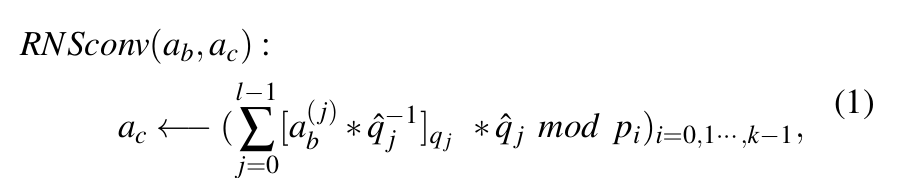

# dload 占位符加载内容说明

本文件用于说明当前项目中各个函数内 `dload` 占位符实际应加载的数据内容，便于测试同学准备输入数据与核对外部访存流。

## 通用约定

- `dload(rs1, rs2, pobj, type)` 仅代表“外部访存读取到片上对象槽位”的占位行为：
  - `type = mod_ctx`：加载模上下文（模数、Barrett/Montgomery 参数等）。
  - `type = poly`：加载多项式/RNS 通道数据或预计算常量（如 twiddle、qhat_inv 等）。
- 代码中 `x0` / `x_offset` / `x_c0` / `x_ct1_up` / `x_ct1_ntt` / `x_evk` / `x_out` / `x_tmp_c0` 等仅是占位地址寄存器名，测试时需用实际的 DMA/HBM 地址替代。
- `pmodld` 的 index 仅用于选择在 `pobj` 中的“第几个模上下文”；若上下文在连续内存中，index 与地址偏移需保持一致。

---

## `generate_hpu_bconv_body_asm`
来源: [src/util/bconv.cpp](src/util/bconv.cpp)

### dload 映射

| 位置 | 目标槽位 | 加载内容 | 说明 |
| --- | --- | --- | --- |
| 预处理阶段开头 | `POBJ_MOD_CTX` | **全部模上下文**（输入 Q 与目标 P） | 供后续 `pmodld` 选择 `q_j / p_i` 上下文 |
| Stage 1: 每个 `q_j` | `POBJ_TMP_A` | `a_j`（输入多项式在 `q_j` 上的通道） | 注释中 `a_j` |
| Stage 1: 每个 `q_j` | `POBJ_TMP_B` | `qhat_inv_j` | 用于 `a_j * qhat_inv_j mod q_j` |
| Stage 2: 每个 `p_i`、每个 `q_j` | `POBJ_TMP_A` | `x_j`（Stage 1 输出的临时结果） | 注释中 `x_j` |
| Stage 2: 每个 `p_i`、每个 `q_j` | `POBJ_TMP_B` | `qhat_modp_j_i` | 预计算常量 |

> 备注：`generate_hpu_modup_body_asm` 直接复用 BConv 的 dload 语义。

---

## `generate_hpu_modup_body_asm`
来源: [src/poly/modup.cpp](src/poly/modup.cpp)

### dload 映射

- 完全等同于 **BConv Q -> P** 的 dload 行为（见上节）。
- 其中 `num_q_digit` 与 `q_offset` 控制输入基的“切片范围”。

---

## `generate_hpu_moddown_body_asm`
来源: [src/poly/moddown.cpp](src/poly/moddown.cpp)

### dload 映射

**Stage 1（BConv P -> Q，生成 correction term）**

- dload 行为与 BConv 相同，但“输入基”为 `P`，“目标基”为 `Q`。
- `q_j / qhat_inv_j / x_j / qhat_modp_j_i` 均应理解为 P->Q 场景对应的常量与中间值。

**Stage 2（修正并降模）**

| 位置 | 目标槽位 | 加载内容 | 说明 |
| --- | --- | --- | --- |
| Stage 2 每个 `q_i` | `POBJ_MOD_CTX` | **全部 Q 模上下文** | 供 `pmodld` 切 `q_i` |
| Stage 2 每个 `q_i` | `POBJ_Q` | `q` 基下的当前密文分量 | 被修正的输入 |
| Stage 2 每个 `q_i` | `POBJ_CORR` | correction term（由 Stage 1 产生） | `q - corr` |
| Stage 2 每个 `q_i` | `POBJ_P_INV` | `P^{-1} mod q_i` | 用于乘回缩放 |

---

## `generate_hpu_cmult_body_asm`
来源: [src/poly/cmult.cpp](src/poly/cmult.cpp)

### dload 映射

| 位置 | 目标槽位 | 加载内容 | 说明 |
| --- | --- | --- | --- |
| 每个 `q_i` | `POBJ_MOD_CTX` | **全部 Q 模上下文** | 供 `pmodld` 选择 `q_i` |
| 乘 `a0*b0` | `POBJ_A` / `POBJ_B` | `a0` / `b0` | 同一 `q_i` 基 |
| 乘 `a1*b1` | `POBJ_A` / `POBJ_B` | `a1` / `b1` | 同一 `q_i` 基 |
| 乘 `a0*b1` | `POBJ_A` / `POBJ_B` | `a0` / `b1` | 同一 `q_i` 基 |
| 乘 `a1*b0` | `POBJ_A` / `POBJ_B` | `a1` / `b0` | 同一 `q_i` 基 |

---

## `generate_hpu_pmult_body_asm`
来源: [src/poly/pmult.cpp](src/poly/pmult.cpp)

### dload 映射

| 位置 | 目标槽位 | 加载内容 | 说明 |
| --- | --- | --- | --- |
| 开头 | `POBJ_MOD_CTX` | **全部 Q 模上下文** | 供 `pmodld` 切 `q_i` |
| 每个 `q_i` 第一次 | `POBJ_CT` | `ct0`（第 0 分量） | 同一 `q_i` 基 |
| 每个 `q_i` 第一次 | `POBJ_PT` | `pt`（明文多项式） | 同一 `q_i` 基 |
| 每个 `q_i` 第二次 | `POBJ_CT` | `ct1`（第 1 分量） | 同一 `q_i` 基 |

> 注：`POBJ_PT` 只在第一次读取，若测试数据分开存放，需确保读指针一致或显式复用。

---

## `generate_hpu_ntt_body_asm` / `generate_hpu_intt_body_asm`
来源: [src/util/ntt.cpp](src/util/ntt.cpp)

### dload 映射

| 位置 | 目标槽位 | 加载内容 | 说明 |
| --- | --- | --- | --- |
| 每个 stage | `twiddle_obj` | NTT/INTT twiddle 表 | 每个 stage 都会加载一次 |

> 备注：函数为**原地变换**，第一个对象槽位为数据对象，第二个对象槽位为 twiddle。函数内对模上下文只给出注释占位，实际 `mod_ctx` 需由调用方在外层加载。

---

## `generate_hpu_keyswitch_body_asm`
来源: [src/operator/keyswitch.cpp](src/operator/keyswitch.cpp)

### dload 映射（核心步骤）

**Step 1: ModUp（Q -> P）**

- 复用 `generate_hpu_modup_body_asm` 的 dload 语义（见上文）。

**Step 2: NTT on Q & P**

| 位置 | 目标槽位 | 加载内容 | 说明 |
| --- | --- | --- | --- |
| 每个基 | `POBJ_TMP_A` | `ct1_up` 的当前基分片 | ModUp 输出的切片 |
| 每个基 | `TWIDDLE` | NTT twiddle 表 | 供 `pntt` 使用 |

**Step 3: Multiply with EVK**

| 位置 | 目标槽位 | 加载内容 | 说明 |
| --- | --- | --- | --- |
| 每个基、每个 `v` | `POBJ_CT` | `ct1_ntt` 当前基分片 | NTT 后的 ct1 |
| 每个基、每个 `v` | `POBJ_EVK` | `evk[v]` 当前基分片 | 评估密钥 |
| 非首 digit | `POBJ_OUT` | 累加中间值 | 来自上一次 digit 结果 |

**Step 4: INTT on Q & P**

| 位置 | 目标槽位 | 加载内容 | 说明 |
| --- | --- | --- | --- |
| 每个基、每个 `v` | `POBJ_TMP_A2` | `out[v]` 当前基分片 | 乘加后的结果 |
| 每个基、每个 `v` | `TWIDDLE2` | INTT twiddle 表 | 供 `pintt` 使用 |

**Step 5: ModDown**

- 复用 `generate_hpu_moddown_body_asm` 的 dload 语义（见上文）。

**Step 6: Add c0 to out0**

| 位置 | 目标槽位 | 加载内容 | 说明 |
| --- | --- | --- | --- |
| 每个 `q_i` | `POBJ_OUT0` | `out0`（ModDown 后） | 当前基分片 |
| 每个 `q_i` | `POBJ_C0` | 原始 `c0` 分量 | 当前基分片 |

---

## `generate_hpu_auto_body_asm`
来源: [src/poly/auto.cpp](src/poly/auto.cpp)

### dload 映射（核心步骤）

**Step 0: c0 的 NTT -> iNTT_auto**

| 位置 | 目标槽位 | 加载内容 | 说明 |
| --- | --- | --- | --- |
| 每个 `q_i` | `SLOT_A` | `c0` 当前基分片 | 来自 `x_c0/x_offset` |
| 每个 `q_i` | `TWIDDLE` | NTT twiddle 表 | NTT 使用 |
| 每个 `q_i` | `TWIDDLE` | 融合 auto 的 iNTT twiddle | iNTT 使用 |

**Step 1: ModUp**

- 复用 `generate_hpu_modup_body_asm` 的 dload 语义（见上文）。

**Step 2: Fused NTT Auto**

| 位置 | 目标槽位 | 加载内容 | 说明 |
| --- | --- | --- | --- |
| 每个基 | `SLOT_A` | `ct1_up` 当前基分片 | ModUp 输出 |
| 每个基 | `TWIDDLE` | NTT twiddle 表 | 融合 auto 的 NTT |

**Step 3: Multiply & Accumulate with EVK**

| 位置 | 目标槽位 | 加载内容 | 说明 |
| --- | --- | --- | --- |
| 每个基、每个 `v` | `SLOT_A` | `ct1_ntt` 当前基分片 | NTT 后 ct1 |
| 每个基、每个 `v` | `SLOT_B` | `evk[v]` 当前基分片 | 评估密钥 |
| 非首 digit | `SLOT_C` | 先前累加值 | 来自 `x_out` |

**Step 4: INTT**

| 位置 | 目标槽位 | 加载内容 | 说明 |
| --- | --- | --- | --- |
| 每个基、每个 `v` | `SLOT_A` | `out[v]` 当前基分片 | 乘加后的结果 |
| 每个基、每个 `v` | `TWIDDLE` | INTT twiddle 表 | 供 iNTT 使用 |

**Step 5: ModDown**

- 复用 `generate_hpu_moddown_body_asm` 的 dload 语义（见上文）。

**Step 6: Final Merge**

| 位置 | 目标槽位 | 加载内容 | 说明 |
| --- | --- | --- | --- |
| 每个 `q_i` | `SLOT_A` | `out0`（ModDown 后） | 当前基分片 |
| 每个 `q_i` | `SLOT_B` | `c0_auto`（Step 0 暂存） | 来自 `x_tmp_c0` |

---

## 未显式包含 dload 的算子

- `generate_hpu_mm_body_asm` 仅执行 `pmul`，无 `dload`（见 [src/util/mm.cpp](src/util/mm.cpp)）。
